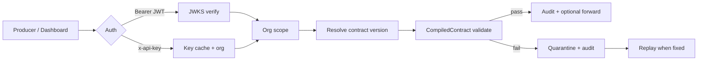

# ContractGate — Architecture Overview

**One-pager for security questionnaires and data-room review.**  
Last updated: 2026-07-15

## Product in one line

Producer → **auth (org)** → **contract** → **validate** (Rust, sub-ms) → **audit** · **forward** or **quarantine** → optional **replay**.

Stop bad events **before** the warehouse.

---

## Components

| Layer | Tech | Role |
|---|---|---|
| Validation gateway | Rust + Axum (`contractgate-server`) | Ingest, validate, quarantine, API |
| Dashboard | Next.js 15 (Vercel) | Contracts UI, playground, billing, usage |
| Data store | Supabase Postgres | Contracts, versions, audit, quarantine, orgs, keys |
| Auth | Supabase JWT (RS256 JWKS) + DB-backed API keys | Browser sessions vs machine keys |
| Ingress (optional) | Kafka consumer pool, Kinesis, HTTP | Platform-side stream pull |
| Self-host | Docker Compose + `make demo` | Local full stack, no signup |

---

## Request path (management + ingest)

**Hot path rules:** `validate()` is total (no panic); contracts compile once (regex, etc.); p99 budget **&lt; 15 ms** end-to-end for typical events. Release builds use `panic = "abort"`.

---

## Ingress surfaces

| Surface | Auth | Notes |
|---|---|---|
| `POST /ingest/{id}` | API key / JWT | Legacy path |
| `POST /v1/ingest/{id}` | API key / JWT | Preferred (idempotency, body caps) |
| `POST /egress/{id}` | API key / JWT | Outbound shape / leakage modes |
| Kafka / Kinesis ingress | Platform config + keys | Feature-flagged binaries |
| Dashboard REST | Bearer JWT | Org from membership |

---

## Multi-tenancy

- **Org** is the isolation unit (`orgs` + memberships).
- Backend uses the **service-role** DB URL (bypasses RLS) and **re-implements** org scope in application queries (RFC-047+).
- Supabase RLS still protects PostgREST paths (`get_my_org_ids()`).
- API keys may further restrict `allowed_contract_ids` (RFC-065).
- Dev escape: `CONTRACTGATE_DEV_NO_AUTH=1` — **never** production.

Auth-on isolation lane: `tests/compose.isolation.yml` + `tests/compose_isolation_smoke.sh` (RFC-075).

---

## Metering (RFC-083)

| Phase | Status |
|---|---|
| Phase 1 — `GET /usage` live count | Shipped |
| Phase 3 — dashboard usage widget | Shipped |
| Phase 2 — ingest 429 + cached counter | **Open** (hot-path; needs p99 smoke) |

Plan limits (backend-owned): Free 1M / Growth 50M / Enterprise unlimited events per UTC calendar month.

---

## Hosting & residency

| Piece | Typical deployment |
|---|---|
| API | Fly.io (`contractgate-api`, primary region `iad`) |
| Dashboard | Vercel (`app.datacontractgate.com`) |
| Database | Supabase Postgres (project region per env) |

Secrets (examples): `DATABASE_URL`, `DASHBOARD_ORIGIN`, Stripe keys (dashboard), optional `SUPABASE_URL` for JWKS when pooler URLs break derivation.

---

## Further reading

- [Security overview](./security-overview.md)
- [Auth reference](./auth-reference.md)
- [Usage reference](./usage-reference.md)
- [Data room index](./data-room/README.md)
- [Ops runbook](./ops/runbook-production.md)
