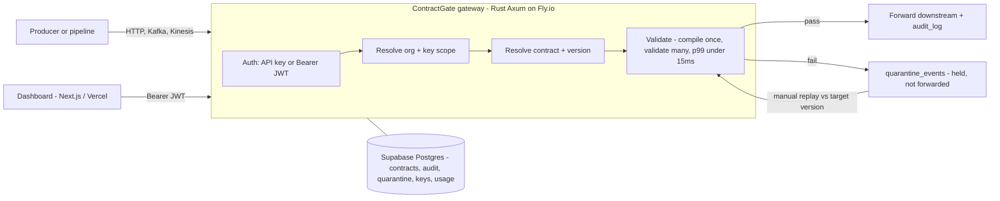

# ContractGate — Architecture Overview

**One-pager for security questionnaires and data-room review.**
Last updated: 2026-07-15.

> Stop bad events **before** they hit the warehouse — semantic contracts enforced
> at ingest, with quarantine/replay and sub-millisecond validation.

## Request flow

## Components

| Component | Tech | Role |
|---|---|---|
| Validation gateway | Rust (Axum), Fly.io `iad` | The engine. Compile-once/validate-many; panic-free hot path; p99 ~31µs measured (target < 15 ms). |
| Dashboard | Next.js + TS + Tailwind, Vercel | Contracts, quarantine/replay, usage, keys, billing. |
| Data store | Supabase Postgres (`us-east-2`, PG 17) | Contracts/versions, `audit_log`, `quarantine_events`, `api_keys` (hashed), org/tenancy, usage. |
| Billing | Stripe Checkout + webhooks | Growth self-serve; plan status on `orgs`. |

## Ingress surfaces

HTTP `POST /ingest/{id}[@version]` and `/v1/ingest` (batch/NDJSON), Kafka ingress
(RFC-025), Kinesis ingress (RFC-026). All share the one validation engine.

## Tenancy & auth (summary)

Per-org isolation enforced at the application layer (service-role DB connection)
and via RLS for browser/PostgREST access; per-key `allowed_contract_ids` bounds
the hot path. Wrong-org access returns 404 (never reveals existence). Auth-on
isolation is proven in CI (RFC-075). Detail: [`auth-reference.md`](./auth-reference.md),
[`security-overview.md`](./security-overview.md).

## Key flows

- **Ingest** → validate → pass forwards + audits; fail quarantines (RFC-004 PII
  masking applied before anything durable).
- **Quarantine → replay** (RFC-003/081): inspect held events, replay against a
  target version; passes drain the backlog.
- **Deploy** (RFC-028): promote a contract version to stable; blocked while
  quarantine is pending.
- **Metering** (RFC-083): per-org monthly usage vs plan limit (`/usage`).

## Data classes & residency

US-only today: app data in Supabase `us-east-2`, compute on Fly.io `iad`. Classes:
contracts/versions, audit log, quarantined events, API-key **hashes** (never raw
keys), Stripe event records, per-org usage. See retention notes in
[`security-overview.md`](./security-overview.md).
